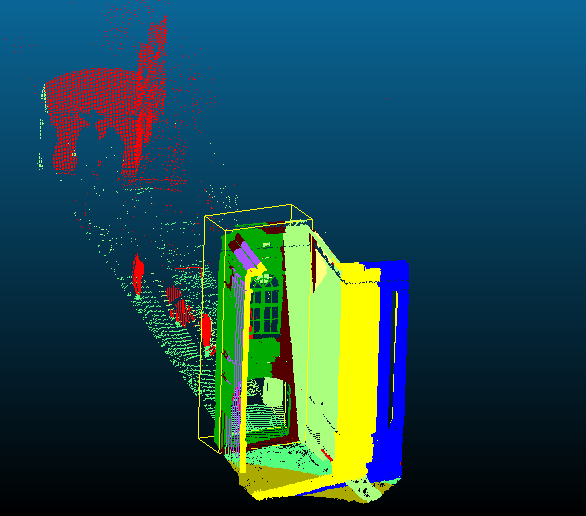

# PRANSAC
This is a generic Plane detection algorithm using RANSAC. It's implementation is based on 3D planes but it can be extended for larger dimensions. The concept implementation is derived from [Gransac implementation](https://github.com/drsrinathsridhar/GRANSAC). 

## Requirements
This library requires a C++11 compiler(GCC 4.7+, Visual Studio 2013+)

## Example Usage
```bash
$ cd
<SOME_DIR>/PRANSAC
$ mkdir build && cd build
$ cmake ..
$ make
$ ./Pransac ../path_to_data
```
Note: A wrapper must be written to parse the Data for Pransac.

An example of detecting planes from a point cloud with each color representing a single plane.


